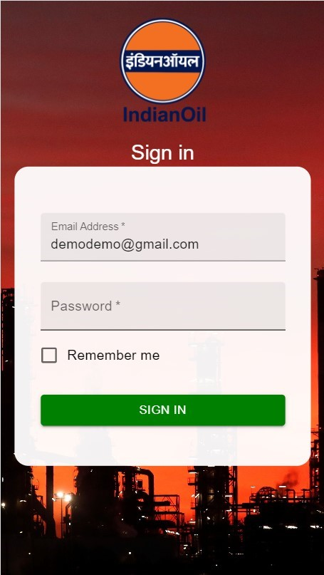
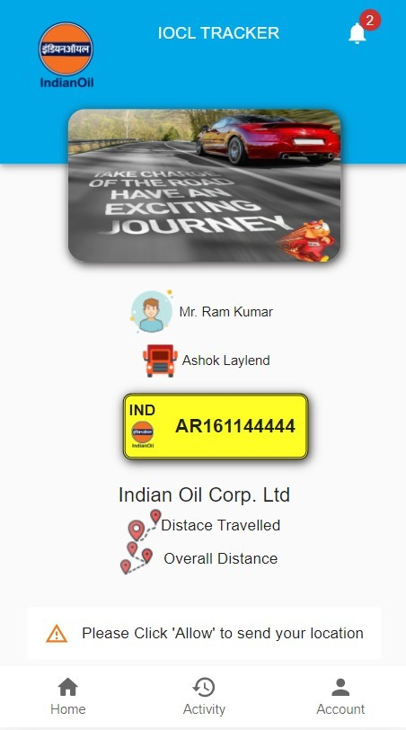
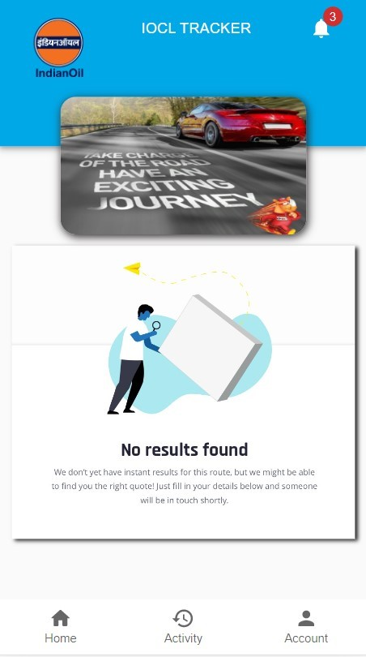
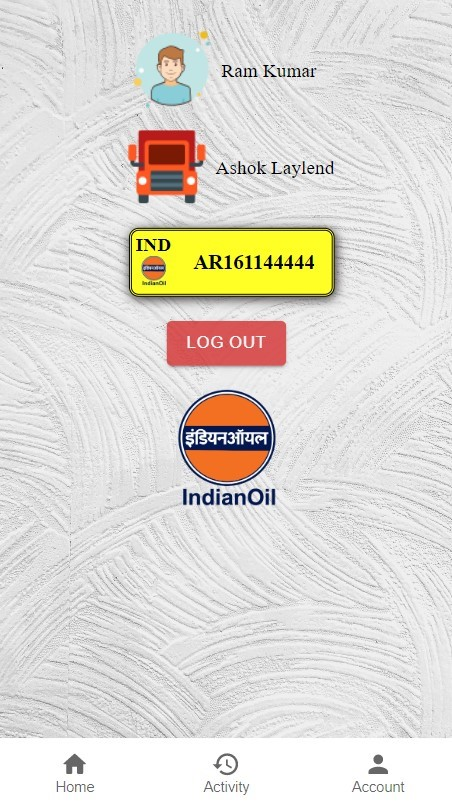

<p align="center">
  
</p>

<div align="center">
<p>GUWAHATI REFINERY</p>
<p>Guwahati, Assam</p>

<p>
WINTER INTERNSHIP PROJECT ON
</p>

## “IOCL VEHICLE MANAGEMENT SYSTEM (CLIENT APPLICATION)”

</div>

### DEVELOPED BY
#### Pursottam Sah & Chandrashekhar Tripathi 
<p> 
B. Tech. in Computer Science and Eng.
<br>
National Institute of Technology, Arunachal Pradesh</p>

#### Shashank Kashyap Sharma
<p> 
Kaziranga University (Assam)</p>

#### Miss Gangortri Bhattacharji
<p> 
Sikkam Manipal Institute of Technology.</p>

### UNDER THE GUIDANCE OF

#### Mr. Sumiron Changkakoti
<p> 
Senior Manager, Information System 
<br>
Indian Oil Corporation Limited, Guwahati </p>

LinkedIn: [Link](https://www.linkedin.com/in/sumiron-changkakoti-7b836925/)

## &

#### Mr. Arjun Singh Banra
<p> 
Assistant Manager, Information System 
<br>
Indian Oil Corporation Limited, Guwahati </p>

LinkedIn: [Link](https://www.linkedin.com/in/arjun-singh-banra-68132619/)


## The Driver Application is implemented using React app as front end and for backend we had used MongoDB and Express Server. 

### Some overview of our application :

1. SingUp Page 
```
The registered driver need to install the application and logged in into the application by the username & password provided by the Transport Officer 
```



<br>
2. Dashboard 

```
After sucessfully being logged in, the application will ask permission to allow their location. 
```
> Note : Without providing the correct location it wont mesure the distance travelled by the vehicle 




<br>

3. The dashboard will display the current location of vehicle as well as important information such as  vehicle registration number, driver name, vehicle name etc

4. Activity page 
```
After some trips the driver can view thier trip history how much they had travelled.
Currently it is empty
```


5. Account 
```
Here the driver can log out from the existing account.
```


## Future Works

1. Geofencing 
2. Overspeeding notification to the driver
3. Emergency Button for help and support 
4. Fuel Informatoin 
